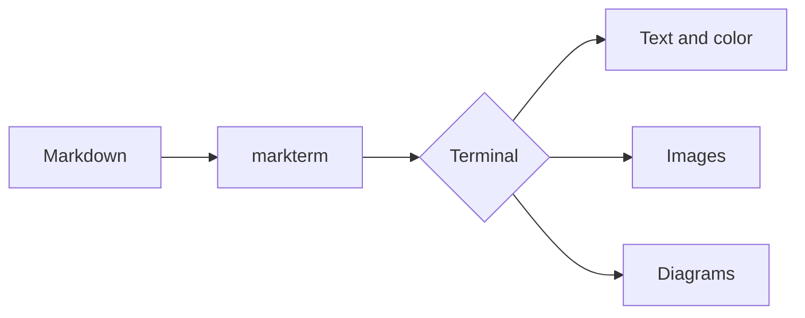

# markterm

A demo document that exercises the Markdown features **markterm** renders.

## Text styling

You can write **bold**, *italic*, ***bold italic***, ~~strikethrough~~, and
`inline code`. Links are clickable in modern terminals: [Rich docs](https://rich.readthedocs.io).

> Blockquotes are great for highlighting a thought.
>
> They can span multiple paragraphs.

## Lists

Unordered:

- Renders headings, lists, and tables
- Highlights fenced code blocks
  - Nested items work too
  - With their own bullets

Ordered:

1. Read the Markdown
2. Render it with Rich
3. Enjoy the colors

Task list:

- [x] Parse Markdown
- [x] Apply terminal styling
- [ ] Conquer the world

## Code

Inline `pip install rich`, and a fenced block with syntax highlighting:

```python
from rich.console import Console
from rich.markdown import Markdown

console = Console()
console.print(Markdown("# Hello, *terminal*!"))
```

```bash
# Pipe any Markdown into the renderer
cat README.md | markterm
```

## Diagrams

Mermaid flowcharts are rendered as ASCII art (requires `mermaid-ascii`):



## Table

| Feature        | Supported | Notes                       |
| -------------- | :-------: | --------------------------- |
| Headings       |     ✅    | Six levels                  |
| Code blocks    |     ✅    | Pygments syntax themes      |
| Tables         |     ✅    | Alignment honored           |
| Images         |     ⚠️    | Shown as links              |

## Images

Local files and remote URLs are drawn inline with half-block characters
(in a truecolor terminal):


## Horizontal rule

---

That's it — point `markterm` at any `.md` file to see it rendered.
